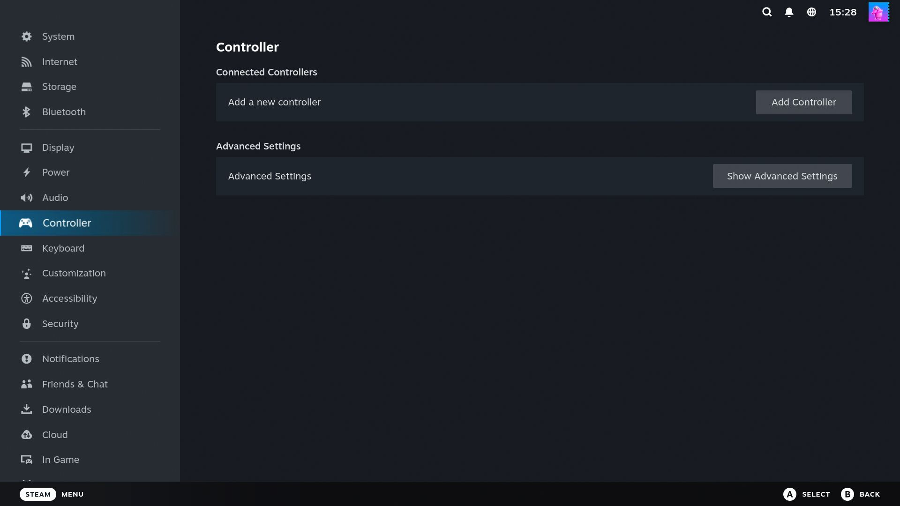

# Bluetooth in your Proxmox VMs. Finally.

Pair your Xbox / PlayStation controller, headphones, or sensors **inside** your gaming VM
(ChimeraOS, Bazzite, Home Assistant, plain Linux) - even with Bluetooth chips that
"can't be passed through".

<p align="center">
  
</p>

## Sound familiar?

- You built a gaming VM on Proxmox. Everything works... except Bluetooth.
- Your controller just blinks, blinks, blinks, and gives up.
- You bought an Intel BE200 / AX210 card because a forum said so. Still nothing.
- You tried `qm set ... -usb`, saw the device in the VM, and it still refused to work.
- Every thread ends with someone saying *"just use a USB cable"*.

**It's not your fault, and your hardware is not broken.**

Intel built their Bluetooth chips so that only the machine that boots them can drive them.
The moment Proxmox hands the chip to a VM, it wipes itself blank. No setting fixes this.
It is physically how the chip works.

## The fix: don't hand over the chip. Share it.

The chip stays on your Proxmox host, where it works. A tiny bridge streams it into the VM
over the local network. Your VM sees a completely normal Bluetooth adapter. Latency is
lower than the controller's own radio delay - you will never feel it.

### Two commands. That's all.

On the **Proxmox host**:

```bash
curl -fsSL https://raw.githubusercontent.com/lucid-fabrics/proxmox-bluetooth/main/install.sh | sudo bash
```

It prints one line. Paste that line **inside your VM**. Done - go pair your controller.

Both sides auto-start at boot and auto-reconnect. Set it up once, forget it exists.

## Does my chip work?

If your Proxmox host can see it, your VM can have it. Run this on the host:

```bash
curl -fsSL https://raw.githubusercontent.com/lucid-fabrics/proxmox-bluetooth/main/install.sh | sudo bash -s -- --check
```

Confirmed by real people (add yours with a PR):

| Hardware | Status |
|---|---|
| Intel BE200 | ✅ Tested - this repo exists because of it |
| Intel AX200 / AX210 / AX211 | ✅ Same family, same behavior |
| MediaTek MT7921 / MT7922 | ✅ Standard Linux support |
| Generic CSR / Realtek USB dongles | ✅ Anything your host's Linux drives |
| UGREEN "BT 6.0" dongles (Barrot chip) | ❌ Broken firmware on Linux, bridge or not. Avoid. |

## FAQ, in human words

**Will my controller lag?**
No. The bridge adds well under a millisecond on the same machine. Bluetooth itself is slower.

**Do I need to buy anything?**
No. The card you already have works. Even the old one you replaced probably worked.

**My controller pairs but nothing responds in Steam (ChimeraOS / Bazzite).**
Known quirk in their input layer, not in Bluetooth: run
`sudo systemctl restart inputplumber`, then turn the controller off and on. Fixed.

**My Intel card looks completely dead. No adapter, scary log lines.**
It is stuck in its blank boot state. Shut the machine down and flip the **power supply
switch off for 15 seconds**, then boot. A reboot is not enough. The front power button is
not enough. This one trick cost us a full day - you're welcome.

**Does the host lose its own Bluetooth?**
Yes, while sharing. A server in a closet rarely misses it. `--uninstall` gives it back.

**Is this Proxmox only?**
No - any Linux host with KVM VMs (or even two separate machines). Proxmox is just where
it hurts the most.

<details>
<summary><b>For the curious: what's actually happening</b></summary>

Intel CNVi Bluetooth (BE200/AX2xx) requires the host's `btusb`/`btintel` driver to load
its firmware at boot. Any passthrough handoff (USB redirect, vfio, driver unbind) resets
the chip to its ROM bootloader, and the guest can never complete the firmware handshake.

The bridge is `btproxy` from the official BlueZ source tree (never shipped in distro
packages). On the host it opens the adapter in HCI user-channel mode and serves raw HCI
over TCP. In the guest it creates a virtual controller via `hci_vhci` and pipes the
stream into it. BlueZ in the guest neither knows nor cares.

Systemd units: `btproxy-server.service` (host, replaces `bluetooth.service`) and
`btproxy-client.service` (guest, ordered before `bluetooth.service` via drop-in).

The bundled binary is built from bluez 5.66 `tools/btproxy` with plain `-O2`
(the default build injects ASAN/UBSAN debug deps). It needs only glibc. See `build.sh`.

</details>

## Support this project

This fix cost a full day of head-scratching, three "dead" reboots, and one very real walk
to the power supply switch. If it saved you that day:

- ☕ [Ko-fi](https://ko-fi.com/lucidfabrics)
- ☕ [Buy Me a Coffee](https://buymeacoffee.com/lucidfabrics)
- 💜 [GitHub Sponsors](https://github.com/sponsors/lucid-fabrics)

## Uninstall

Same script, `--uninstall`, on whichever machine you want to restore.

## License

MIT
