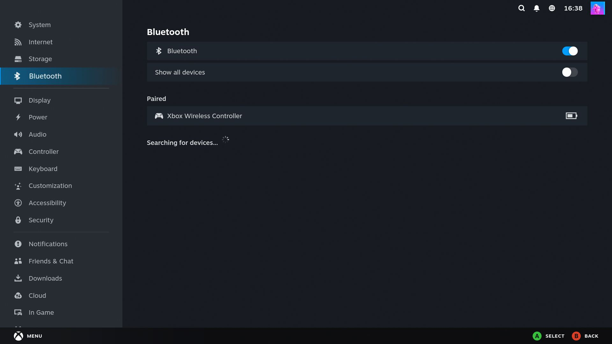

# Bluetooth in your Proxmox Linux VMs. Finally.

[](https://ko-fi.com/lucidfabrics)
[](https://buymeacoffee.com/lucidfabrics)
[](https://github.com/sponsors/lucid-fabrics)
[](LICENSE)

Pair your Xbox / PlayStation controller, headphones, or sensors **inside** your gaming VM
(ChimeraOS, Bazzite, Home Assistant, plain Linux) - even with Bluetooth chips that
"can't be passed through".

<p align="center">
  
</p>

## Sound familiar?

- You built a gaming VM on Proxmox. Everything works... except Bluetooth.
- Your controller just blinks, blinks, blinks, and gives up.
- You bought an Intel BE200 / AX210 card because a forum said so. Still nothing.
- You tried `qm set ... -usb`, saw the device in the VM, and it still refused to work.
- Every thread ends with someone saying *"just use a USB cable"*.

**It's not your fault, and your hardware is not broken.**

Intel built their Bluetooth chips so that only the machine that boots them can drive them.
The moment Proxmox hands the chip to a VM, it wipes itself blank. No setting fixes this.
It is physically how the chip works.

## The fix: don't hand over the chip. Share it.

The chip stays on your Proxmox host, where it works. A tiny bridge streams it into the VM
over the local network. Your VM sees a completely normal Bluetooth adapter. Latency is
lower than the controller's own radio delay - you will never feel it.

### Two commands. That's all.

On the **Proxmox host**:

```bash
curl -fsSL https://raw.githubusercontent.com/lucid-fabrics/proxmox-bluetooth/main/install.sh | sudo bash
```

You'll see something like this:

```
==> Bluetooth adapters on this machine:
    [0] hci0 - 70:08:10:A4:F1:45 (USB)
==> All adapters healthy. You are good to go.
==> Bluetooth (hci0) is now shared on 192.168.1.3:9700.

  Now run this INSIDE your VM:

    curl -fsSL https://raw.githubusercontent.com/lucid-fabrics/proxmox-bluetooth/main/install.sh | sudo bash -s -- 192.168.1.3
```

**What to do:** copy that last line exactly (your IP will be different) and run it inside the VM.

Inside the VM, you'll see:

```
==> Done. This VM now has working Bluetooth. Go pair your controller.
```

**What to do:** open Bluetooth settings in the VM and pair like normal. That's it.

Both sides auto-start at boot and auto-reconnect. Set it up once, forget it exists.

## Does my chip work?

If your Proxmox host can see it, your VM can have it. Run this on the host:

```bash
curl -fsSL https://raw.githubusercontent.com/lucid-fabrics/proxmox-bluetooth/main/install.sh | sudo bash -s -- --check
```

If it's healthy, you'll see:

```
==> Bluetooth adapters on this machine:
    [0] hci0 - 70:08:10:A4:F1:45 (USB)
==> All adapters healthy. You are good to go.
```

**What to do:** nothing - run the install command above.

If your chip is the stuck-Intel-chip case, you'll see:

```
!! hci0 is NOT responding (stuck in bootloader).
   Fix: shut down, flip the power supply switch OFF for 15 seconds, boot.
   A reboot or the front power button is NOT enough. See README.
```

**What to do:** exactly what it says. This looks extreme but it's the one thing that
actually works - see the FAQ below for why.

Confirmed by real people (add yours with a PR):

| Hardware | Status |
|---|---|
| Intel BE200 | ✅ Tested - this repo exists because of it |
| Intel AX200 / AX210 / AX211 | ✅ Same family, same behavior |
| MediaTek MT7921 / MT7922 | ✅ Standard Linux support |
| Generic CSR / Realtek USB dongles | ✅ Anything your host's Linux drives |
| UGREEN "BT 6.0" dongles (Barrot chip) | ❌ Broken firmware on Linux, bridge or not. Avoid. |

## FAQ, in human words

**Will my controller lag?**
No. The bridge adds well under a millisecond on the same machine. Bluetooth itself is slower.

**Do I need to buy anything?**
No. The card you already have works. Even the old one you replaced probably worked.

**My whole VM "died" - black screen, no network (ChimeraOS / Bazzite).**
It didn't die - it went to sleep. Gaming distros auto-suspend after idle like a
Steam Deck, and a VM with GPU passthrough never wakes from that. Turn suspend off
for good inside the VM:
`sudo systemctl mask sleep.target suspend.target hibernate.target hybrid-sleep.target`

**My controller pairs but nothing responds in Steam (ChimeraOS / Bazzite).**
Known quirk in their input layer, not in Bluetooth: run
`sudo systemctl restart inputplumber`, then turn the controller off and on. Fixed.

**My Intel card looks completely dead. No adapter, scary log lines.**
It is stuck in its blank boot state. Shut the machine down and flip the **power supply
switch off for 15 seconds**, then boot. A reboot is not enough. The front power button is
not enough. This one trick cost us a full day - you're welcome.

**I have more than one Bluetooth chip on the host.**
`--check` lists every adapter it finds (`hci0`, `hci1`, ...) with its MAC address so you
can tell them apart, and if it finds more than one it won't guess - it'll ask you to pick.
Share a specific one with `./install.sh --adapter 1`. Bridging two chips into two different
VMs *at the same time* isn't supported yet (one install per host today) - open an issue if
you need it, it's a small change.

**Does the host lose its own Bluetooth?**
Yes, while sharing. A server in a closet rarely misses it. Need it back for a moment?
`--pause` returns the chip to the host, `--resume` hands it back to the VM (which
reconnects by itself). `--uninstall` removes everything for good.

**What about Windows VMs?**
The bridge is for Linux guests (it relies on Linux's Bluetooth stack). Windows VMs
usually don't have this problem: passing a USB dongle straight through with
`qm set <vmid> -usb0 host=<id>` just works there. This tool exists because Linux
guests choke where Windows shrugs.

**Is this Proxmox only?**
No - any Linux host with KVM VMs (or even two separate machines). Proxmox is just where
it hurts the most.

<details>
<summary><b>For the curious: what's actually happening</b></summary>

Intel CNVi Bluetooth (BE200/AX2xx) requires the host's `btusb`/`btintel` driver to load
its firmware at boot. Any passthrough handoff (USB redirect, vfio, driver unbind) resets
the chip to its ROM bootloader, and the guest can never complete the firmware handshake.

The bridge is `btproxy` from the official BlueZ source tree (never shipped in distro
packages). On the host it opens the adapter in HCI user-channel mode and serves raw HCI
over TCP. In the guest it creates a virtual controller via `hci_vhci` and pipes the
stream into it. BlueZ in the guest neither knows nor cares.

Systemd units: `btproxy-server.service` (host, replaces `bluetooth.service`) and
`btproxy-client.service` (guest, ordered before `bluetooth.service` via drop-in).

The bundled binary is built from bluez 5.66 `tools/btproxy` with plain `-O2`
(the default build injects ASAN/UBSAN debug deps). It needs only glibc. See `build.sh`.

</details>

## Support this project

This fix cost a full day of head-scratching, three "dead" reboots, and one very real walk
to the power supply switch - so nobody else has to lose that day. Tools like this stay free
and maintained for exactly one reason: people who were helped choose to help the next person
in line. If that's you right now, thank you. It genuinely keeps this alive.

<p align="left">
  <a href="https://ko-fi.com/lucidfabrics"></a>
  <a href="https://buymeacoffee.com/lucidfabrics"></a>
  <a href="https://github.com/sponsors/lucid-fabrics"></a>
</p>

## Uninstall

Same script, `--uninstall`, on whichever machine you want to restore.

## License

MIT
